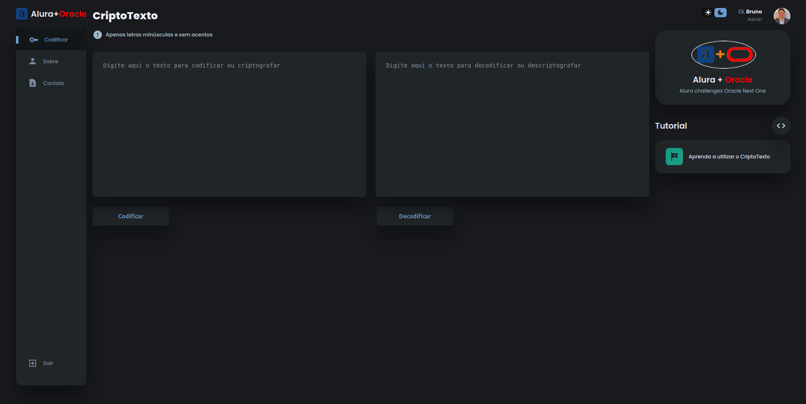
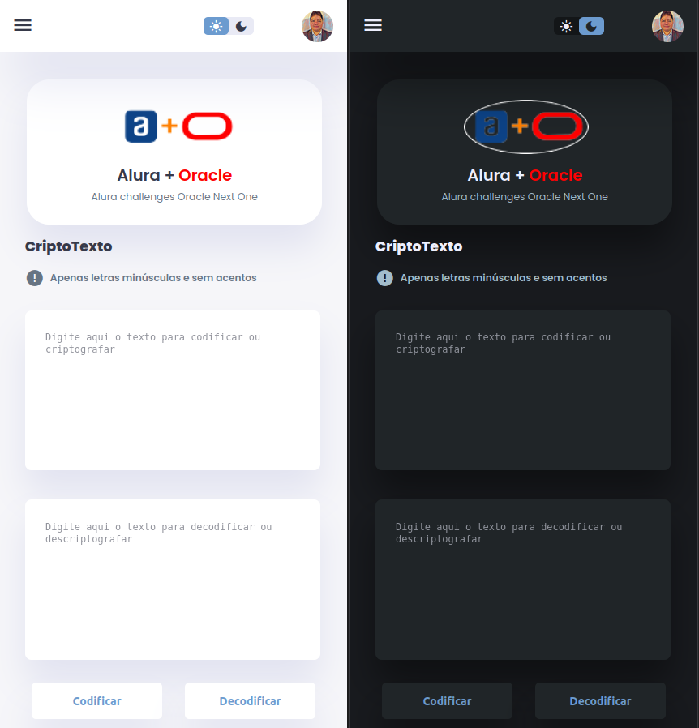
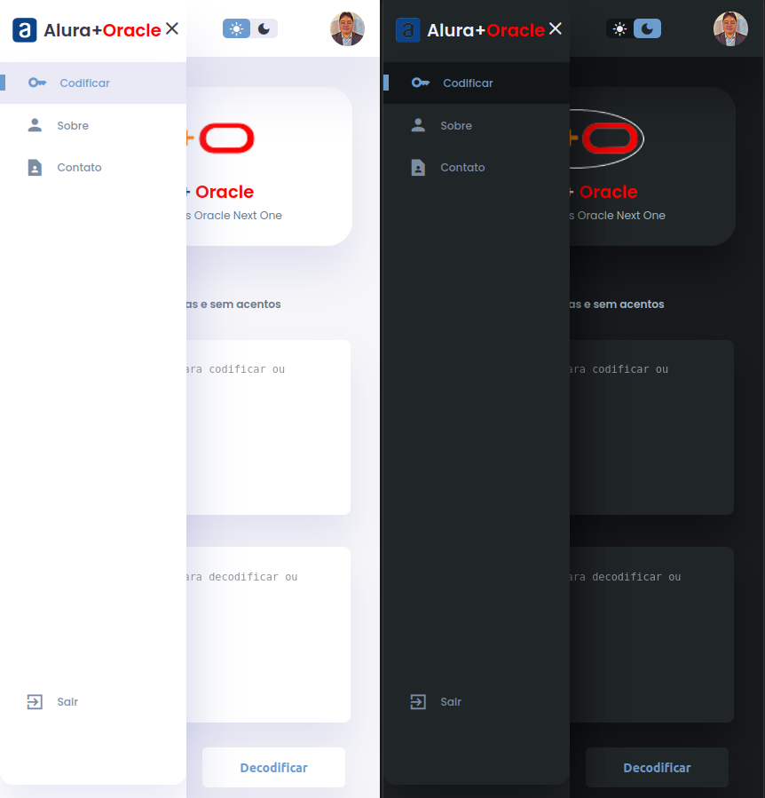

# CriptoTexto - #challengeonedecodificador5

Um sistema web para criptografar e descriptografar textos, apenas utilizando letras minúsculas e sem acentos. Esse desafio #challengeonedecodificador5 tem como objetivo propor o aprimoramento do conhecimento adquirido durante o curso de formação em programação.

## :dizzy: Tecnologias utilizadas

[](HTML5-url)
[](CSS3-url)
[](JavaScript-url)


## :computer: Visão Geral do Projeto

### Interface do Usuário - lightMode: 


### Interface do Usuário - darkMode: 


<br />

### Interface do Usuário Responsiva:

<div style="display: flex; justify-content: space-between; margin-right: 50px;"> 
   <div>
      <h4>Sem o Menu Mobile</h4>
      
   </div>
   <div>
      <h4>Com o Menu Mobile</h4>
      
   </div>
</div>

## :hammer: Funcionalidades

- `Codificar`: codificação de texto inserido pelo usuário.
- `Copiar`: copiar o texto criptografado para compartilhar entre amigos(as).
- `Decodificar`: decodificação do texto criptografado.
- `Responsividade`: responsivo para diferentes dispositivos.
- `DarkMode e LightMode`: darkMode e lightMode com armazenamento no localStorage.
- `Tutorial`: tutorial básico para ensinar a usar o CriptoTexto.
- `Menu Mobile`: menu responsivo, localizado no canto superior a esquerda.
- `Sobre`: consta um resumo de quem eu sou e minhas redes sociais.
- `Contato`: informações fictícias.

## :mag: Demonstração

Para visualizar a demonstração do CriptoTexto, [clique aqui](https://charlesbrcosta.github.io/CriptoTexto-challengeonedecodificador5/).

## :warning: Pré-requisitos

- Navegador web moderno que suporte HTML5, CSS3 e JavaScript.

## :dvd: Instalação

1. Clone o repositório:

   ```bash
   git clone https://github.com/seu-usuario/seu-projeto.git
   cd seu-projeto

2. Abra o arquivo index.html no seu navegador.

## :open_file_folder: Como usar

1. Digite o texto na área indicada.
2. Clique no botão "Codificar" para criptografar o texto.
3. Clique no botão "Decodificar" para descriptografar o texto.
4. Siga as instruções apresentadas no tutorial da página para melhores práticas de uso.

## :paperclip: Contribuição

1. Faça um fork do projeto.
2. Crie uma branch para a sua contribuição (git checkout -b feature/nova-funcionalidade).
3. Faça as alterações necessárias e commit (git commit -am 'Adicionando nova funcionalidade').
4. Push para a branch (git push origin feature/nova-funcionalidade).
5. Crie um novo Pull Request.

## :student: Autor

[<br><sub>Charles Bruno</sub>](https://github.com/charlesbrcosta)


## :page_facing_up: Licença

Este projeto está licenciado sob a [Licença MIT](https://www.mit.edu/~amini/LICENSE.md).